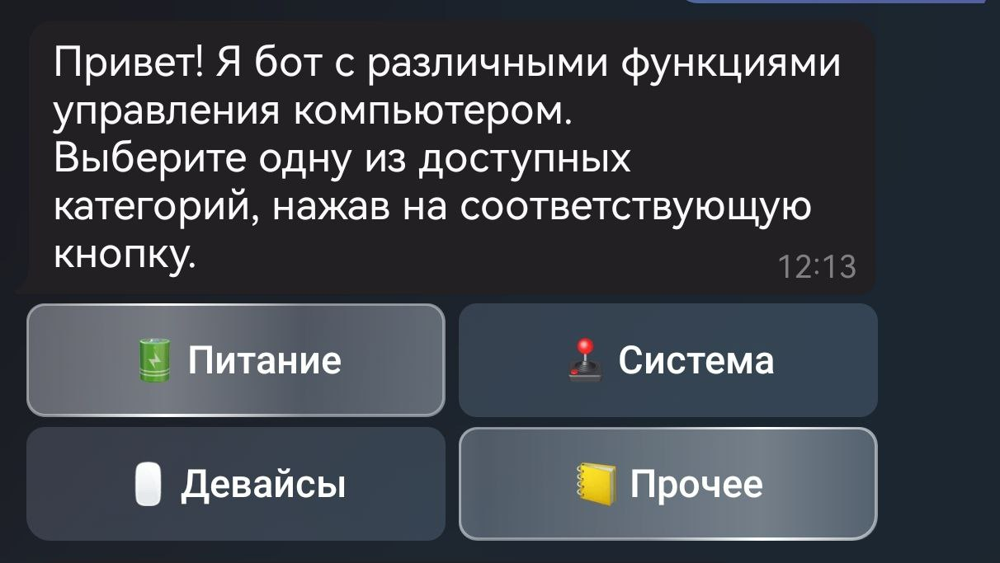
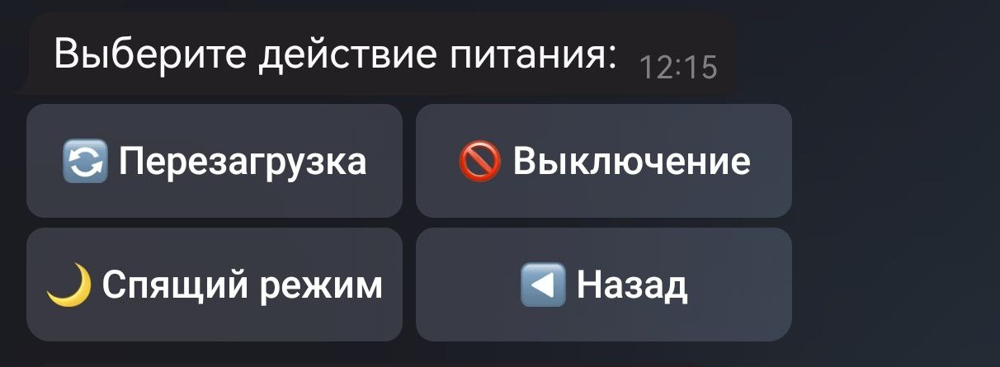
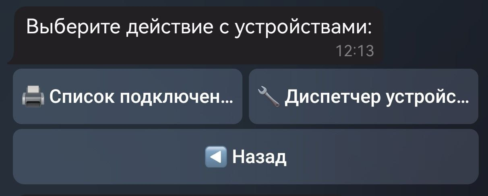
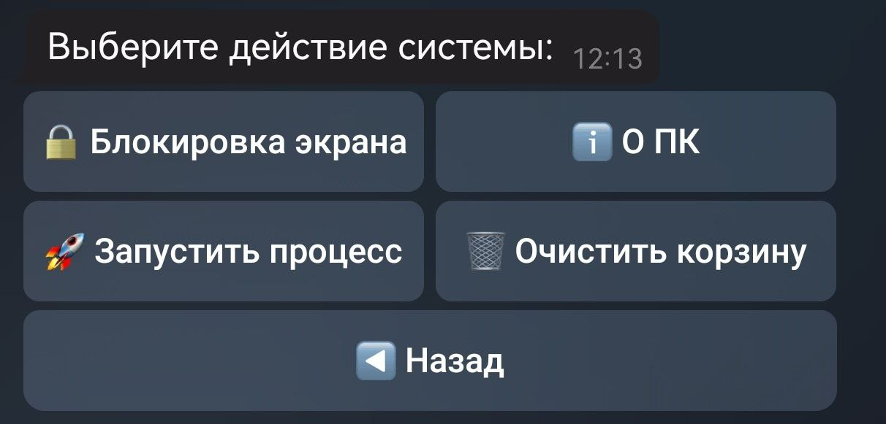
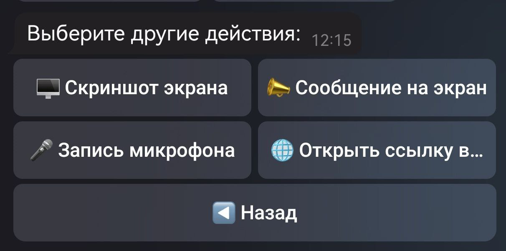

# PC Tools Bot

Это скрипт на Python, созданный для упрощенного и защищенного управления вашим компьютером через Telegram бота. Скрипт позволяет делать скриншоты экрана, управлять мышкой, управлять файлами и процессами, выполнять команды в командной строке, выключать или перезагружать компьютер, а также загружать и скачивать файлы на компьютер.

## Установка и запуск

1. Склонируйте репозиторий на свой компьютер.
2. Запустите Start.bat и дождитесь установки необходимых библиотек (если их нет).
3. Создайте телеграм бота, перейдя в Telegram и начав диалог с BotFather.
4. Создайте нового бота, следуя инструкциям BotFather.
5.После создания бота, скопируйте полученный токен.
Запустите start.bat и введите полученный токен, когда программа запросит его.
В боте, который вы создали в Telegram, отправьте команду /start, чтобы начать использование скрипта.
   

## Использование

1. После запуска скрипта, он запросит вас ввести токен вашего Telegram бота. Получите токен бота, создав нового бота в Telegram через [BotFather](https://core.telegram.org/bots#botfather).
2. Вставьте полученный токен в программу, когда она запросит: `Введите токен бота: ТУТ ВАШ ТОКЕН`.
3. Запустите бота, нажав `/start` в боте, который вы создали.

## Функции бота 🤖

#### 1. **Управление питанием** (🔋 Питание)
- **Перезагрузка** (🔄 Перезагрузка): Позволяет перезагрузить компьютер.
- **Выключение** (🚫 Выключение): Позволяет выключить компьютер.
- **Спящий режим** (🌙 Спящий режим): Переводит компьютер в спящий режим.

#### 2. **Управление системой** (🕹️ Система)
- **Блокировка экрана** (🔒 Блокировка экрана): Блокирует экран компьютера.
- **Информация о ПК** (ℹ️ О ПК): Отображает информацию о текущей операционной системе, использовании процессора и памяти.
- **Запустить процесс** (🚀 Запустить процесс): Позволяет запустить процесс по его имени.
- **Очистить корзину** (🗑️ Очистить корзину): Очищает корзину системы.

#### 3. **Управление устройствами** (🖱️ Девайсы)
- **Список подключенных устройств** (🖨️ Список подключенных устройств): Отображает список подключенных устройств.
- **Диспетчер устройств** (🔧 Диспетчер устройств): Открывает диспетчер устройств.

#### 4. **Дополнительные функции** (📒 Прочее)
- **Скриншот экрана** (🖥️ Скриншот экрана): Создает и отправляет скриншот экрана.
- **Сообщение на экран** (📣 Сообщение на экран): Отображает сообщение на экране компьютера.
- **Запись микрофона** (🎤 Запись микрофона): Записывает звук с микрофона в течение 5 секунд.
- **Открыть ссылку в браузере** (🌐 Открыть ссылку в браузере): Открывает указанную ссылку в браузере.

---

## Скриншоты📜

### 1. Главное меню

---

### 2. Управление питанием

---

### 3. Управление устройствами

---

### 4. Управление системой

---

### 5. Дополнительные функции

## Разработчик

- GitHub: [FluxProv](https://github.com/ВашGitHubUsername)

## Поддержать

Вы можете поддержать меня печенькой:

- Карта Tinkoff: 2200701200821012

© 2024 FluxProv

